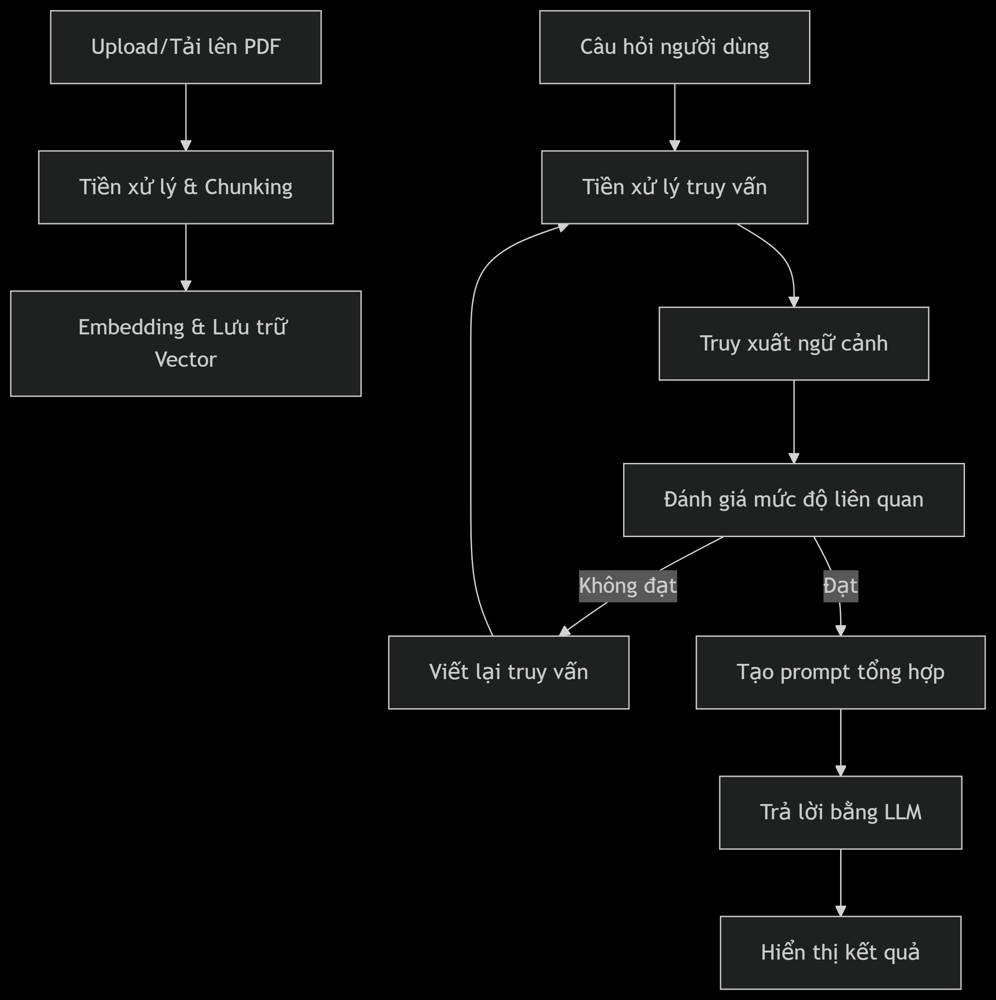
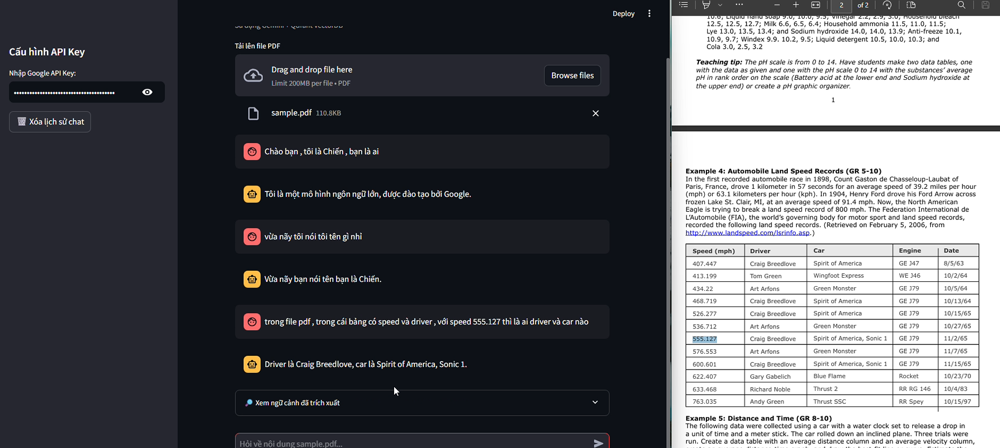

# RAG Chatbot with PDF 


This project is a Retrieval-Augmented Generation (RAG) chatbot designed to process Vietnamese PDF documents, extract both text and tables, and answer user queries using Google Gemini AI and Qdrant vector database.


## Key Features

- Upload and process PDF documents (including tables and text)
- Chunk and clean Vietnamese text for embedding
- Generate embeddings using Google Generative AI
- Store and search document chunks in Qdrant vector database
- Rerank search results using CrossEncoder
- Rewrite queries for better retrieval using Gemini
- Streamlit-based interactive chat interface
- **Supports Vietnamese language natively**
- **Extracts and merges both tables and text from PDFs**
- **Optimized for large documents and efficient chunking**
- **Interactive chat history and context display**
- **Automatic collection management in Qdrant**
- **Robust error handling and retry logic for API calls**
- **Easy integration with Google Gemini and Qdrant**
- **Modular codebase for easy extension and maintenance**


## Demo Video

[▶️ WATCH VIDEO demo](https://youtu.be/4fRv5LewfwE)


## Folder Structure

```
rag-chatbot/
├── README.md
├── requirements.txt
├── data/
│   ├── document.pdf
│   └── KTDL_PCA.pdf
├── src/
│   ├── app.py
│   ├── embedding/
│   │   └── __init__.py
│   ├── pdf_processing/
│   │   ├── __init__.py
│   │   └── test.py
│   ├── retrieval/
│   │   └── __init__.py
│   ├── rewrite/
│   │   └── __init__.py
│   ├── temp/
│   ├── utils/
│   │   └── __init__.py
│   └── vectordb/
│       └── __init__.py
```

## Quick Start

1. **Install dependencies**  
   ```
   pip install -r requirements.txt
   ```
2. **Install Qdrant Server (using Docker):** 
    ``` 
    docker pull qdrant/qdrant
    docker run -p 6333:6333 qdrant/qdrant
    ```

3. **Run the chatbot**  
   ```
   streamlit run src/app.py
   ```

4. **Usage**  
   - Enter your Google API Key in the sidebar.
   - Upload a PDF document.
   - Ask questions about the document in Vietnamese.

## Main Components

- [`src/app.py`](src/app.py): Streamlit app and main workflow
- [`src/pdf_processing/__init__.py`](src/pdf_processing/__init__.py): PDF extraction and chunking
- [`src/embedding/__init__.py`](src/embedding/__init__.py): Embedding generation
- [`src/vectordb/__init__.py`](src/vectordb/__init__.py): Qdrant vector database operations
- [`src/retrieval/__init__.py`](src/retrieval/__init__.py): Reranking with CrossEncoder
- [`src/rewrite/__init__.py`](src/rewrite/__init__.py): Query rewriting with Gemini
- [`src/utils/__init__.py`](src/utils/__init__.py): Utility functions

## Requirements

- Python 3.10+
- Google API Key for Gemini
- Qdrant running locally (`127.0.0.1:6333`)
- All dependencies in [`requirements.txt`](requirements.txt)

## License

This project is for educational and research purposes only.
